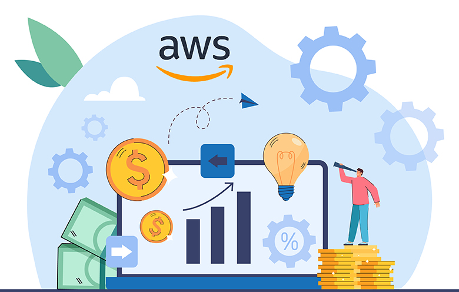

# AWS Cost Optimization using Lambda Functions

## Overview
This project focuses on optimizing AWS costs by automating various cost-saving tasks using AWS Lambda functions. The project includes Python scripts for:

- Deleting unused EBS snapshots.
- Identifying and stopping underutilized EC2 instances.
- Releasing unused Elastic IPs.
- Moving old S3 objects to Glacier storage.
- Sending alerts for underutilized resources.


## Features
- **Automated EBS Snapshot Cleanup**: Deletes snapshots that are not associated with active volumes.
- **EC2 Optimization**: Identifies EC2 instances with CPU utilization below 10% and stops them.
- **Elastic IP Cleanup**: Releases Elastic IPs that are not associated with running instances.
- **S3 Storage Optimization**: Moves S3 objects older than 30 days to Glacier storage for cost reduction.
- **Alerting Mechanism**: Sends notifications via AWS SNS for underutilized EC2 instances.

## AWS Services Used
- AWS Lambda
- Amazon EC2
- Amazon S3
- Amazon CloudWatch
- Amazon SNS
- Amazon Glacier

## Setup Instructions
1. **Create an AWS Lambda function** for each script and upload the corresponding Python file.
2. **Attach IAM roles** with appropriate permissions:
   - `AmazonEC2FullAccess`
   - `AmazonS3FullAccess`
   - `CloudWatchReadOnlyAccess`
   - `AmazonSNSFullAccess`
3. **Set up CloudWatch Event Rules** to trigger Lambda functions at regular intervals.
4. **Configure SNS Topics** for alert notifications.
5. **Test the Lambda functions** using sample event payloads.



## Python Scripts
### 1. **Delete Unused EBS Snapshots**
Deletes EBS snapshots that are not associated with any active volumes.
```python
import boto3
...
```

### 2. **Identify and Stop Underutilized EC2 Instances**
Finds EC2 instances with CPU utilization below 10% over the past day and stops them.
```python
import boto3
...
```

### 3. **Release Unused Elastic IPs**
Releases Elastic IPs that are not in use.
```python
import boto3
...
```

### 4. **Move Old S3 Objects to Glacier**
Moves objects older than 30 days to Glacier storage to reduce S3 costs.
```python
import boto3
...
```

## Conclusion
By automating these cost-saving tasks, this project helps in optimizing AWS resource usage and reducing unnecessary expenses. Future enhancements could include auto-scaling recommendations and integrating more cost-saving strategies.

